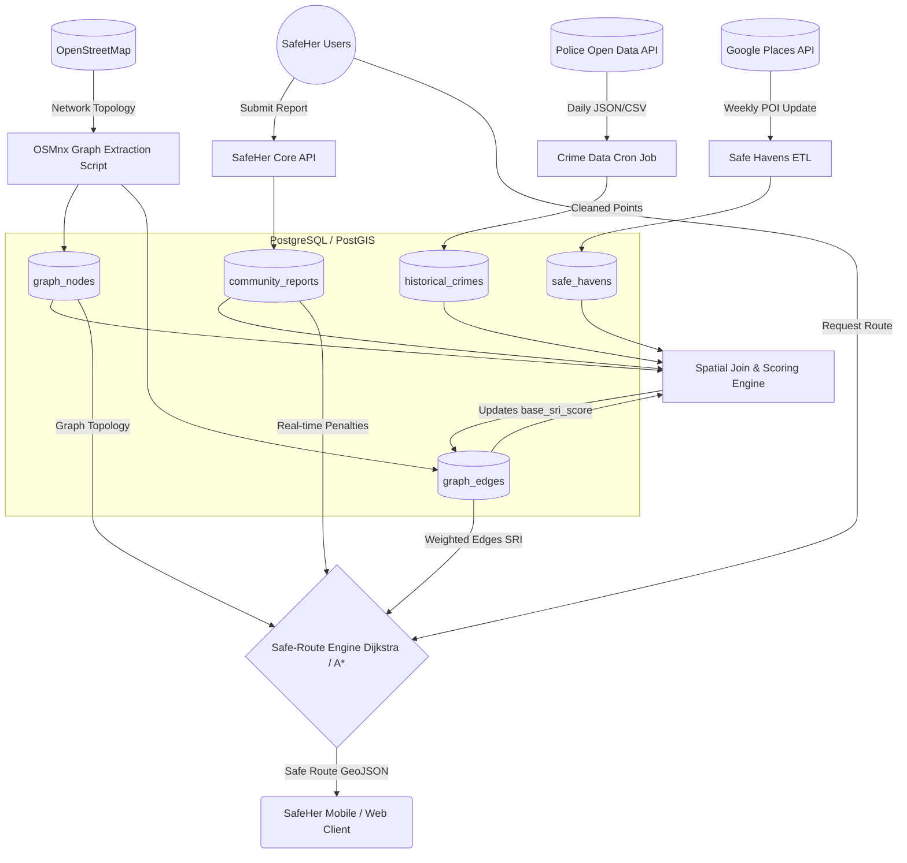

# SafeHer AI - Data Architecture Design

**Status:** Draft | **Author:** Lead Architect | **Project:** SafeHer AI

This document outlines the data architecture, acquisition strategy, and ETL pipelines required to implement the Phase 1 SafeHer Risk Index (SRI) and Routing Engine.

---

## 1. Phase 1 Datasets

To build the MVP, we will rely on a combination of open-source geographic data, commercial APIs, and municipal open data. 

| Dataset | Source | API Availability | Update Frequency | Cost | Geographic Coverage | Integration Difficulty |
| :--- | :--- | :--- | :--- | :--- | :--- | :--- |
| **Base Road Network** | OpenStreetMap (via OSMnx) | Yes (Overpass API) | Monthly (Batch) | Free | Global | Low |
| **Safe Havens (POIs)** | Google Places API / Yelp API | Yes (REST API) | Weekly/On-Demand | Paid (per call) | Global | Low |
| **Historical Crime** | City/Police Open Data Portals | Varies (Socrata, REST) | Daily/Weekly | Free | City-specific | Medium (Data formats vary) |
| **Community Reports** | SafeHer Mobile/Web App | Internal API | Real-time | Internal | Where users exist | Low (Internal) |
| **Street Lighting (Proxy)** | OpenStreetMap (Highway tags) | Yes (Overpass API) | Monthly (Batch) | Free | Global | Low |

> [!NOTE]
> To manage costs in Phase 1, we can substitute the Google Places API with OSM POIs (e.g., `amenity=police`, `shop=convenience`) via the Overpass API, falling back to Google Places only for dynamic opening hours.

---

## 2. PostgreSQL / PostGIS Schema

The core routing engine requires a pre-calculated graph. We will store nodes (intersections) and edges (street segments), alongside overlay data.

```sql
-- Enable PostGIS extension
CREATE EXTENSION IF NOT EXISTS postgis;

-- 1. Base Graph: Nodes (Intersections)
CREATE TABLE graph_nodes (
    node_id BIGINT PRIMARY KEY,          -- OSM Node ID
    geom GEOMETRY(Point, 4326),          -- EPSG:4326 (Lat/Lon)
    intersection_type VARCHAR(50)        -- e.g., 'traffic_signals', 'stop'
);
CREATE INDEX idx_graph_nodes_geom ON graph_nodes USING GIST(geom);

-- 2. Base Graph: Edges (Street Segments)
CREATE TABLE graph_edges (
    edge_id SERIAL PRIMARY KEY,
    u BIGINT REFERENCES graph_nodes(node_id), -- Source node
    v BIGINT REFERENCES graph_nodes(node_id), -- Target node
    geom GEOMETRY(LineString, 4326),          -- Line geometry
    length_m FLOAT,                           -- Distance in meters
    highway_type VARCHAR(50),                 -- 'primary', 'residential', 'footway'
    is_lit BOOLEAN DEFAULT false,             -- Extracted from OSM lit tag or proxy
    base_sri_score FLOAT DEFAULT 0.0          -- Pre-computed static risk score
);
CREATE INDEX idx_graph_edges_geom ON graph_edges USING GIST(geom);

-- 3. Dynamic Overlay: Safe Havens
CREATE TABLE safe_havens (
    haven_id SERIAL PRIMARY KEY,
    source_id VARCHAR(255),               -- Google Place ID or OSM ID
    name VARCHAR(255),
    type VARCHAR(50),                     -- 'hospital', 'police', '24/7_store'
    geom GEOMETRY(Point, 4326),
    opening_hours JSONB,                  -- Operating schedule
    last_verified TIMESTAMP
);
CREATE INDEX idx_safe_havens_geom ON safe_havens USING GIST(geom);

-- 4. Dynamic Overlay: Historical Crime
CREATE TABLE historical_crimes (
    crime_id VARCHAR(255) PRIMARY KEY,
    category VARCHAR(100),                -- 'assault', 'robbery'
    geom GEOMETRY(Point, 4326),
    incident_time TIMESTAMP,
    severity_weight FLOAT                 -- Pre-calculated weight based on crime type
);
CREATE INDEX idx_crimes_geom ON historical_crimes USING GIST(geom);
CREATE INDEX idx_crimes_time ON historical_crimes(incident_time);

-- 5. Dynamic Overlay: Community Reports
CREATE TABLE community_reports (
    report_id UUID PRIMARY KEY,
    user_id UUID,
    category VARCHAR(50),                 -- 'harassment', 'poor_lighting', 'suspicious'
    geom GEOMETRY(Point, 4326),
    created_at TIMESTAMP DEFAULT CURRENT_TIMESTAMP,
    expires_at TIMESTAMP                  -- Reports fade out after a certain time
);
CREATE INDEX idx_reports_geom ON community_reports USING GIST(geom);
```

---

## 3. ETL Pipeline Design

The ETL pipeline ensures the graph edges have up-to-date SRI weights.

### A. Extraction
*   **Static Graph (Monthly):** A Python script uses `OSMnx` to download the street network for a defined bounding box (e.g., a city) and extracts Nodes and Edges.
*   **Crime Data (Daily):** Airflow or Cron triggers a script to pull the last 24 hours of crime incidents from the local Police API.
*   **Safe Havens (Weekly):** Query Google Places/OSM for new businesses or updated hours.
*   **Community Reports (Real-time):** Ingested continuously via the SafeHer backend API.

### B. Cleaning
*   Standardize all geometries to EPSG:4326.
*   Deduplicate crime reports based on incident IDs.
*   Filter out irrelevant crime categories (e.g., white-collar fraud) focusing on street-level safety (assault, theft, harassment).

### C. Feature Engineering (Spatial Joins)
This is where the magic happens. We map the overlays to the street edges.
1.  **Crime Density:** Perform a PostGIS `ST_DWithin` spatial join to count how many severe crimes occurred within 50 meters of each `graph_edge` over the last 6 months. Update `base_sri_score`.
2.  **Safe Haven Proximity:** Calculate the distance from each edge to the nearest active `safe_haven`. If distance < 100m, apply a safety discount to the `base_sri_score`.
3.  **Lighting Inference:** If OSM `highway_type` = 'primary', infer `is_lit = true`.

### D. Storage
*   Bulk insert/upsert data into the PostgreSQL tables.
*   The `graph_edges` table now holds a pre-computed baseline risk score that the routing engine can query instantly.

---

## 4. Component Interaction

*   **OpenStreetMap (OSM):** Acts as the foundational data source. It provides the literal layout of the physical world (where the streets and intersections are).
*   **OSMnx:** A Python library that consumes raw OSM data and converts it into a mathematically routable graph (Nodes and Edges). It handles the complex logic of one-way streets, driving vs. walking paths, and extracts it into dataframes that we dump into PostgreSQL (`graph_nodes`, `graph_edges`).
*   **Google Places:** Acts as a dynamic POI overlay. While OSM has roads, Google Places knows exactly which convenience stores are open *right now* at 2 AM. These points are mapped onto the OSMnx graph to create "Safe Zones."
*   **Crime Datasets & Community Reports:** Act as dynamic risk overlays. Crime data provides long-term historical risk for an edge, while Community Reports provide short-term, acute risk (e.g., "Suspicious person on this corner 10 mins ago").
*   **Interaction:** The SafeHer Routing algorithm uses the OSMnx-generated edges to find paths, but instead of minimizing distance, it minimizes the sum of the Risk Overlays (Crime + Community Reports) while maximizing proximity to Safe Overlays (Google Places).

---

## 5. Data Flow Diagram


